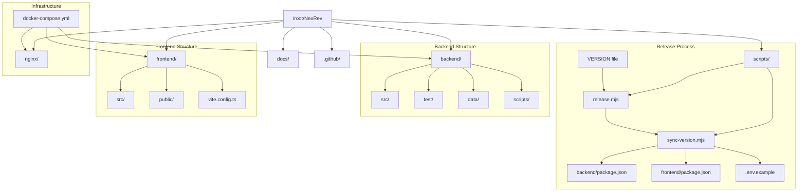

# NexRev Project Architecture

This diagram visualizes the structure and relationships within the NexRev project.

## Component Overview

- **Backend**: Node.js/TypeScript application handling data and API logic.
- **Frontend**: Vite-powered TypeScript application for the user interface.
- **Scripts**: Maintenance and utility scripts, including the version release workflow.
- **Nginx**: Web server configuration for routing and serving the applications.
- **Docs**: Project documentation and architecture details.
- **Infrastructure**: Containerized setup using Docker and Docker Compose.
